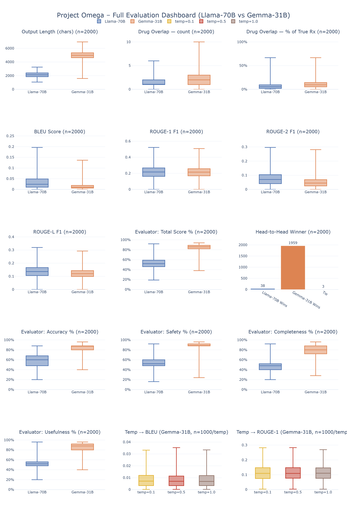
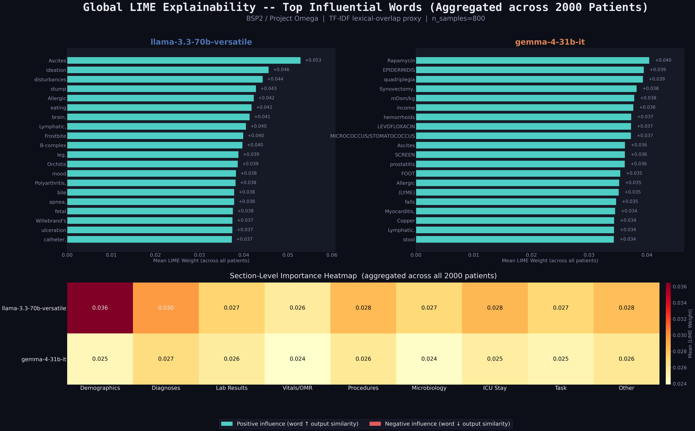

# Large Language Models for Clinical Diagnosis and Treatment Recommendation

**Project Omega**  Bachelor Semester Project S2, Academic Year 2025/26
University of Luxembourg  Can Yildiz, Nina Vojtassak, Tuna Karakus

---

## Overview

This repository contains the full evaluation pipeline for **Project Omega**, a systematic comparison of two open-weight large language models on real-world clinical tasks.

We tested **Meta's LLaMA-3.3-70B** and **Google's Gemma-4-31B** on clinical diagnosis hypothesization and treatment recommendation using patient records from the **MIMIC-IV** database (2008-2024). Each model received the same structured prompt built from ICD diagnoses, lab results, ICU vitals, procedures, and anthropometric data and was asked to produce a differential diagnosis, treatment plan, safety flags, and a confidence rating.

**The key finding is counterintuitive:** Gemma-4-31B wins **97.9%** of head-to-head clinical evaluations, yet scores *lower* on BLEU and ROUGE. The explanation is a brevity bias in n-gram metrics LLaMA's short, terse outputs happen to overlap more with concise ICD reference strings, even though they carry less clinical value. This finding motivates moving away from lexical metrics when evaluating free-form clinical text.

---

## Results at a Glance

| Metric | Llama-3.3-70B | Gemma-4-31B |
|---|---|---|
| Drug overlap (median count) | 1 | 2 |
| Drug overlap (median %) | ~5% | ~12% |
| Median output length | ~2,200 chars | ~5,000 chars |
| BLEU (median) | ~0.03 | ~0.015 |
| ROUGE-1 F1 (median) | ~0.21 | ~0.21 (nearly equal) |
| ROUGE-2 F1 (median) | ~0.07 | ~0.05 |
| ROUGE-L F1 (median) | ~0.14 | ~0.12 |
| Evaluator total score | ~52% | ~85% |
| Evaluator: Accuracy | ~60% | ~85% |
| Evaluator: Safety | ~52% | ~90% |
| Evaluator: Completeness | ~47% | ~80% |
| Evaluator: Usefulness | ~52% | ~85% |
| Head-to-head wins (n=2,000) | 38 (1.9%) | 1,959 (97.9%), 3 ties |
### Temperature Sensitivity (Gemma-4-31B, n=1000)

| Metric | Temp = 0.1 | Temp = 0.5 | Temp = 1.0 |
|---|---|---|---|
| BLEU (median) | ~0.007 | ~0.007 | ~0.007 |
| ROUGE-1 (median) | ~0.11 | ~0.11 | ~0.11 |
---

## Evaluation Dashboard



*Full dashboard for 2,000 MIMIC-IV patients. Top rows show output statistics and lexical metrics. Middle row shows head-to-head win counts and total evaluator scores. Bottom rows break down the four clinical quality dimensions (accuracy, completeness, safety, usefulness) and the temperature sensitivity experiment.*

---

## LIME Explainability



*Global LIME results aggregated across 50 patients per model. Bars show mean absolute influence weight per token. Teal = positive influence, coral = negative. Bottom panels are section-level heatmaps showing which parts of the prompt (Diagnoses, Lab Results, Vitals/OMR, etc.) drive each model's output most strongly.*

---

## Repository Structure

```
.
|-- bsp_report/
|   |-- figures/
|   |   |-- evaluation_dashboard.png     # Full 15-panel evaluation dashboard
|   |   `-- lime_chart.png               # LIME explainability chart
|   |-- README.md
|   |-- DISCLAIMER.md
|   `-- .gitignore
|
`-- multiple patients pipeline/
    |-- patients_pipeline.py             # Main pipeline: LLM inference + autonomous evaluation
    |-- bleu_rouge_metrics.py            # BLEU / ROUGE-1/2/L calculation
    |-- temperature_test.py              # Temperature sensitivity experiment (T=0.1, 0.5, 1.0)
    |-- graph_maker.py                   # Dashboard visualization
    `-- lime_analyzer.py                 # LIME-based explainability analysis
```

---

## Getting Started

### Requirements

- Python 3.10+
- Access to [MIMIC-IV v3.1](https://physionet.org/content/mimiciv/3.1/) via PhysioNet credentialed access
- API keys for:
  - [Groq](https://console.groq.com) -- LLaMA-3.3-70B and the GPT-OSS 120B evaluator both run on Groq
  - [Google AI Studio](https://aistudio.google.com) -- Gemma-4-31B runs via the Gemini API

### Install

```bash
pip install groq transformers shap lime pandas numpy scikit-learn evaluate rouge-score nltk colorama duckdb
```

### Set up the database

Place your MIMIC-IV CSV files under `mimic-iv-3.1/` and run:

```bash
python init_db.py
```

This imports the relevant tables into a local DuckDB file (`mimic.db`) for fast querying.

### Run the pipeline

```bash
cd "multiple patients pipeline"
python patients_pipeline.py      # Step 1: LLM inference + evaluator scoring
python bleu_rouge_metrics.py     # Step 2: BLEU / ROUGE metrics
python temperature_test.py       # Step 3: Temperature sensitivity experiment
python graph_maker.py            # Step 4: Build dashboard
python lime_analyzer.py          # Step 5: LIME explainability
```

---

## Data & Ethics

All clinical data comes from the de-identified **MIMIC-IV v3.1** database (Johnson et al., PhysioNet, 2024). Access was granted through PhysioNet after completing CITI training and signing the data use agreement.

**No raw patient data is included in this repository.** The local database file (`mimic.db`) and the raw CSV exports are excluded by `.gitignore`. All results are aggregated across the full cohort.

See [DISCLAIMER.md](DISCLAIMER.md) for the full disclaimer on medical use and data handling.

---

## Citation

```bibtex
@misc{projectomega2026,
  title  = {Large Language Models for Clinical Diagnosis and Treatment Recommendation},
  author = {Yildiz, Can and Vojtassak, Nina and Karakus, Tuna},
  year   = {2026},
  school = {University of Luxembourg},
  note   = {Bachelor Semester Project S2}
}
```

MIMIC-IV dataset:

```bibtex
@article{mimic4,
  author  = {Johnson, Alistair and Bulgarelli, Lucas and Pollard, Tom and
             Gow, Brian and Moody, Benjamin and Horng, Steven and
             Celi, Leo Anthony and Mark, Roger},
  title   = {MIMIC-IV (version 3.1)},
  journal = {PhysioNet},
  year    = {2024},
  doi     = {10.13026/kpb9-mt58}
}
```

---

## License

Code is provided for academic and research purposes only. MIMIC-IV data is subject to the [PhysioNet Credentialed Health Data License](https://physionet.org/content/mimiciv/3.1/#license).
